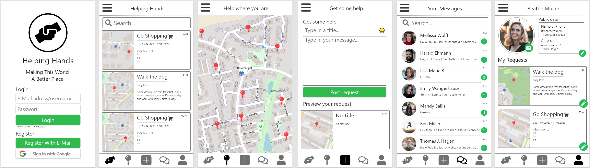

# Helping Hands

Is an application that is aimed to enable people to get help from people and to help people in their neighborhood.

The project is open source and licensed under the MIT License:
Check the [LICENSE](LICENSE) file for further information

- The app is soly aimed towards helping people
- Because of the current corona crisis we strive to develop the app as quickly as possible!

### Features of the app:

- A Feed where users can see nearby requests
- A map where people can see how many requests are around them
- A screen where users can post new requests
- A messenger where users can chat with other users
- A profile page where people can edit their data
- Safe authentication & server communication

#### What can people do with the app? - Request any kind of help!

#### Who could use the app? - Anyone that needs help!

Some use cases people could need help with:

- Go shopping to buy groceries
- Drive to the doctor
- Walk the dog
- Feed pets during absence
- Change a broken lightbulb
- Mow the lawn

### Technologies used:

- [Flutter SDK](https://flutter.dev/) (cross-platform app development)
- [Dart](https://dart.dev/) (programming language)
- [Firebase](https://firebase.google.com/) (server backend)
- [Material Design](https://material.io/design/) (design pattern)

## We would love you to contribute to the app

### How you can help now

- Develop the app with us!
- Suggest features and enhancements over the Issues tab
- Spread the word to other developers that can help

### How you can help once the app is released

- Spread the word to other people that the app is there
- Support us financially, so that we can pay server costs and improve the app
- Test the app once released & report bugs and things that need to be enhanced
- Translate the app into another language that the app doesn't support yet