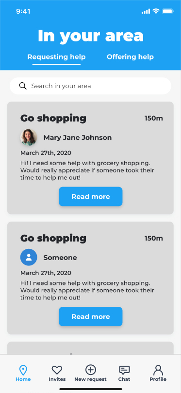

# Duapp

Duapp is an app enabling people to request help from volunteers, and enabling volunteers to offer help to those who need it.

The project is open source and licensed under the MIT License:
Check the [LICENSE](LICENSE) file for further information

- Because of the current corona crisis we strive to develop the app as quickly as possible!
- Even tough we want to develop the app quickly, safe authentication & server communication as well as the privacy of users are very important for us.

### Features of the app:

- Users can see nearby requests for help
- Users can see nearby volunteers that offer help
- Users can post requests for help
- Users can post what they can help others with
- Chat to coordinate how and when help should be given
- User profiles to give a quick introduction between users
- Search for requests/offers to quickly find things you can do or volunteers that can help you

## Some tasks people could need help with:

### During the Coronavirus crisis - contactless help:

- Go shopping
- Pickup medicine
- Walk the dog
- Someone to talk with

### After the Coronavirus crisis - general help:

- Drive to the doctor
- Change a broken lightbulb
- Mow the lawn
- Baybysit
- Teach someone to play the piano

### Technologies used:

- [Flutter SDK](https://flutter.dev/) (cross-platform app development)
- [Dart](https://dart.dev/) (programming language)
- [Firebase](https://firebase.google.com/) (server backend)

### Design of the app:

- We will base everything on [Material Design](https://material.io/design/) (design pattern)

## We would love you to contribute to the app

### How you can help now

- Develop the app with us!
- Suggest features and enhancements in the Issues tab
- Spread the word to other developers that can help

### How you can help once the app is released

- Spread the word to other people that the app is there
- Support us financially, so that we can pay server costs and improve the app
- Test the app once released and report bugs or suggest how it could be improved
- Translate the app into another language

## App functionality:

- Users can see people that need help with some task
- Users can see an approximate distance to the person
- Users can see a short description what the person needs help with
- Users can offer their help
- If the person requesting help is not anonymus, users see their name and profile image
- Users can search for requests requiring specific skills

- Users can see more details regarding the request
- Users can offer their help and write a small introduction to start the conversation

- Users can see people that offer particular skills
- Users can see an approximate distance to the person
- Users can see a short description about the person
- Users can request their help
- Users see their name and profile image
- Users can search for volunteers with specific skills

- Users can see a description of the person along with a number of skills they have to offer
- Users can request the help from that person and give a short description of what they need help with

- Users can reconnect with people who helped them before

- Users can communicate to come to agreement on how and when the help should happen

- Users can create new requests for help

- Users can give others a quick introduction to themselves through their profile
